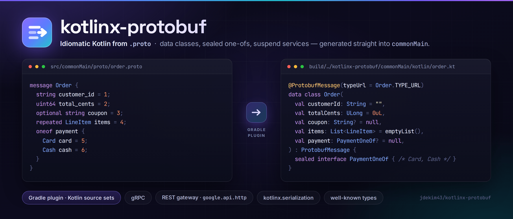

<div align="center">



[](https://central.sonatype.com/artifact/kim.jade/kotlinx-protobuf)
[](https://plugins.gradle.org/plugin/kim.jade.kotlinx-protobuf)
[](https://kotlinlang.org/)
[](LICENSE)

</div>

`kotlinx-protobuf` compiles `.proto` files into Kotlin you would have been willing to write by hand —
`data class` messages, `sealed interface` one-ofs, `suspend` service interfaces — and puts them straight
into `commonMain`.

The Gradle plugin is the point. Google's `com.google.protobuf` plugin attaches to the Java plugin's
`main` and `test` source sets, so a Kotlin Multiplatform project has to stand up a JVM-only submodule,
generate there, and copy the result into `commonMain` by hand. This plugin talks to Kotlin source sets
directly, so there is nothing to work around:

```kotlin
import kim.jade.kotlinx.protobuf.gradle.proto

plugins {
    kotlin("multiplatform")
    id("kim.jade.kotlinx-protobuf") version "0.7.0-beta.1"
}

kotlin {
    sourceSets {
        commonMain {
            proto { kotlin() }
        }
    }
}
```

Drop your protos in `src/commonMain/proto` and build.

> [!NOTE]
> The **runtime libraries publish JVM and JS targets**, and every generator has a JS half: converters go
> through protobuf.js, gRPC through `@grpc/grpc-js`, the REST gateway through Ktor. The gRPC one is Node
> only — gRPC runs over HTTP/2 on a socket, which a browser cannot open; a browser wants `grpcGateway()`.
> Native targets are not published.

---

## Contents

- [Quick start](#quick-start) · [Examples](#examples) · [How it works](#how-it-works)
- [Generated code](#generated-code) — [types](#type-mapping) · [presence](#presence-and-what-null-means) · [one-ofs](#one-ofs) · [services](#services-and-streaming) · [converters](#converters-any-and-registries) · [options](#options-carried-over)
- [Generators](#generators) — [what each one brings](#what-a-generator-brings-with-it) · [the JS converters](#the-js-converters) · [gRPC and REST on JS](#grpc-and-the-rest-gateway-on-js) · [options](#generator-options)
- [Plugin reference](#plugin-reference) — [project](#project-wide-settings) · [source sets](#source-sets) · [protoc outputs](#protoc-builtins-and-plugins) · [your own generators](#adding-your-own-generator) · [tasks](#tasks-and-configurations) · [committing output](#committing-generated-sources)
- [Runtime modules](#runtime-modules) — [gRPC](#grpc) · [REST gateway](#rest-gateway) · [well-known types](#well-known-types)
- [Outside Gradle](#using-the-generators-outside-gradle) · [Migrating](#migrating-from-comgoogleprotobuf) · [Building this repository](#building-this-repository)

## Quick start

### Kotlin Multiplatform

```kotlin
import kim.jade.kotlinx.protobuf.gradle.proto

plugins {
    kotlin("multiplatform")
    id("kim.jade.kotlinx-protobuf") version "0.7.0-beta.1"
}

kotlinxProtobuf {
    typeUrlPrefix("type.googleapis.com")
}

kotlin {
    jvm()

    sourceSets {
        commonMain {
            proto {                       // from src/commonMain/proto
                kotlin()
                converterMultiplatform()
            }
            dependencies {
                implementation("kim.jade:kotlinx-protobuf:0.7.0-beta.1")
            }
        }
    }
}
```

`converterMultiplatform()` emits `expect` declarations, so it registers the platform halves itself —
`converterMultiplatformJvm()` and the protoc `java` builtin those delegate to on the JVM source set,
`converterMultiplatformJs()` on a `js()` one — each reading the same protos and reusing `commonMain`'s
descriptor set. There is no `jvmMain` or `jsMain` block to write. `grpcMultiplatform()` works the same
way.

### `kotlin("jvm")`

Same plugin, single-platform generators, and the source set is called `main`:

```kotlin
import kim.jade.kotlinx.protobuf.gradle.proto

plugins {
    kotlin("jvm")
    id("kim.jade.kotlinx-protobuf") version "0.7.0-beta.1"
}

dependencies {
    implementation("kim.jade:kotlinx-protobuf:0.7.0-beta.1")
}

kotlin.sourceSets.named("main") {
    proto {                               // from src/main/proto
        kotlin()
        converterJvm()
    }
}
```

`proto` is an extension on `KotlinSourceSet`, which is why both snippets start with
`import kim.jade.kotlinx.protobuf.gradle.proto` — Gradle's Kotlin DSL only generates accessors for
extensions on its own types, and `KotlinSourceSet` belongs to the Kotlin Gradle plugin.

## Examples

[`examples/`](examples) has one module per reason people reach for protobuf. Each one applies the plugin
the way a consumer would, prints what it does, and asserts the same claims in a test suite.

| Module | Use case | Run it |
|---|---|---|
| [serialization](examples/serialization) | compact bytes for the wire, JSON when a human reads it | `./gradlew :examples:serialization:run` |
| [schema-evolution](examples/schema-evolution) | two versions of a message deployed at once | `./gradlew :examples:schema-evolution:run` |
| [event-envelope](examples/event-envelope) | an event stream whose payload type arrives with it — `Any` | `./gradlew :examples:event-envelope:run` |
| [grpc](examples/grpc) | a service contract, with all four streaming shapes | `./gradlew :examples:grpc:run` |
| [rest-gateway](examples/rest-gateway) | HTTP/JSON from `google.api.http`, generated into `commonMain` | `./gradlew :examples:rest-gateway:run` |

## How it works

```
src/<sourceSet>/proto/**.proto
        │
        ├─ generate<SourceSet>ProtoDescriptorSet    protoc, once → <sourceSet>.pb
        │                                           (+ any protoc builtins and plugins)
        │
        └─ generate<SourceSet>Proto                 Gradle worker, reading that .pb → Kotlin
                    │
                    └─ build/generated/sources/kotlinx-protobuf/<sourceSet>/<generator>/
                              wired into the Kotlin source set
```

protoc runs **once** per source set, and its only required output is a `FileDescriptorSet`. The Kotlin
generators then run in a Gradle worker straight from that file, so:

- there is no `protoc-gen-*` launcher script to make executable, and nothing OS-specific to get wrong;
- generation is a pure `descriptor.pb → files` step, so up-to-date checks, the build cache and the
  configuration cache all work;
- generator options are typed Gradle properties rather than a comma-separated string.

Each generator writes to its own output directory, which matters because several of them deliberately
emit the same relative path — the `expect` converter in `commonMain` and its `actual` in `jvmMain`.

## Generated code

```protobuf
message Order {
  string customer_id = 1;
  uint64 total_cents = 2;
  optional string coupon = 3;
  repeated LineItem items = 4;
}
```

```kotlin
@ProtobufMessage(typeUrl = Order.TYPE_URL)
public data class Order(
    @ProtobufIndex(index = 1) @ProtobufJsonName(jsonName = "customerId")
    public val customerId: String = "",
    @ProtobufIndex(index = 2) @ProtobufJsonName(jsonName = "totalCents")
    public val totalCents: ULong = 0uL,
    @ProtobufIndex(index = 3) @ProtobufJsonName(jsonName = "coupon")
    public val coupon: String? = null,
    @ProtobufIndex(index = 4) @ProtobufJsonName(jsonName = "items")
    public val items: List<LineItem> = emptyList(),
) : ProtobufMessage {
    public companion object {
        public const val TYPE_URL: String = "type.googleapis.com/example.order.v1.Order"
    }
}
```

Every file also carries `@file:GeneratorVersion(…)` and a `// Transform from <path>.proto` header. In the
emitted file both `ProtobufMessage`s are imported under aliases — `AnnotationProtobufMessage` for the
annotation, `TypeProtobufMessage` for the interface — because they share a name across two packages.

### Type mapping

| proto | Kotlin | default |
|---|---|---|
| `double` / `float` | `Double` / `Float` | `0.0` / `0.0f` |
| `int32`, `sint32`, `sfixed32` | `Int` | `0` |
| `int64`, `sint64`, `sfixed64` | `Long` | `0L` |
| `uint32`, `fixed32` | `UInt` | `0u` |
| `uint64`, `fixed64` | `ULong` | `0uL` |
| `bool` | `Boolean` | `false` |
| `string` | `String` | `""` |
| `bytes` | `ByteArray` | `byteArrayOf()` |
| `enum E` | `E` | `E.entries.first()` |
| `Message` | `Message?` | `null` |
| `repeated T` | `List<T>` | `emptyList()` |
| `map<K, V>` | `Map<K, V>` | `emptyMap()` |
| `oneof o { … }` | `OOneOf?` | `null` |

Unsigned scalars really are `UInt`/`ULong`, not the signed types protoc-gen-java falls back to. Field
names are camel-cased, Kotlin keywords are backtick-escaped, and a message with no fields is a plain
`class` rather than a `data class`.

`bytes` gets special treatment: a message holding one carries generated `equals`/`hashCode` that compare
the array by content. Kotlin's own would compare by identity, which makes two messages with identical
bytes unequal and unusable as `Map` keys.

Enums are generated **dense**: `E.forNumber(n)` throws `NoSuchElementException` for a number the schema
does not declare, rather than returning an `UNRECOGNIZED` sentinel. A value added by a newer peer is a
failure you can see, not one you find later.

### Presence, and what null means

**A field is nullable exactly when protobuf says it has presence** — one rule across every syntax, and no
exception carved out for message fields:

| proto | Kotlin |
|---|---|
| proto3 `string name = 1;` | `String = ""` — implicit presence, so empty *is* absent |
| proto3 `optional string name = 1;` | `String? = null` |
| proto2 `optional int32 n = 1;` | `Int? = null` |
| proto2 `required string id = 1;` | `String` — no default, so the compiler asks for it |
| editions `[features.field_presence = IMPLICIT]` | as proto3 |
| `repeated string tags = 4;` | `List<String> = emptyList()` — the empty list is the absent value |
| `map<string, int32> counts = 5;` | `Map<String, Int> = emptyMap()` |
| `Options options = 6;` | `Options? = null` — singular messages have presence in every syntax |

proto2 `[default = …]` is **recorded, not applied**: absence stays `null`, because "not set" and "the
value proto2 falls back to" are different facts and only the first one is on the wire. The declared
default is carried on the field as `@ProtobufOption(key = "default_value", value = "\"3\"")`.

### One-ofs

A `oneof` becomes a nullable property whose type is a `sealed interface` nested in the message. `null` is
the state it is in before any branch is set.

```protobuf
message Payment {
  oneof method {
    Card card = 1;
    bytes voucher = 2;
  }
}
```

```kotlin
public data class Payment(
    public val method: MethodOneOf? = null,
) : ProtobufMessage {
    public sealed interface MethodOneOf {
        @JvmInline
        public value class Card(public val `value`: example.v1.Card = example.v1.Card()) : MethodOneOf

        public data class Voucher(public val `value`: ByteArray = byteArrayOf()) : MethodOneOf { /* content equals */ }
    }
}
```

### Services and streaming

Each RPC keeps its streaming shape, following the same conventions as grpc-kotlin:

| proto | Kotlin |
|---|---|
| `rpc F(Req) returns (Resp)` | `suspend fun f(request: Req): Resp` |
| `rpc F(Req) returns (stream Resp)` | `fun f(request: Req): Flow<Resp>` |
| `rpc F(stream Req) returns (Resp)` | `suspend fun f(requests: Flow<Req>): Resp` |
| `rpc F(stream Req) returns (stream Resp)` | `fun f(requests: Flow<Req>): Flow<Resp>` |

```kotlin
public interface ChatService : ProtobufService {
    public suspend fun sendMessage(request: SendMessageRequest): SendMessageResponse
    public fun subscribe(request: SubscribeRequest): Flow<ChatEvent>
    public suspend fun importHistory(requests: Flow<ChatMessage>): ImportSummary
    public fun converse(requests: Flow<ChatMessage>): Flow<ChatMessage>
}
```

### Converters, `Any`, and registries

`kotlin()` emits the types; a **converter generator** emits the codec for them. Every message gets a
`<Type>Converter`, reachable as an extension on the companion:

```kotlin
val bytes = Order.converter.serialize(order)
val decoded = Order.converter.deserialize(bytes)

val any = order.toAny()             // typeUrl comes from Order.TYPE_URL
val unpacked = Order.parse(any)     // throws if the Any holds something else
```

`parse` hangs off the message's companion rather than off `Any`, so a file declaring several messages
gets one entry point per type instead of overloads that cannot be told apart.

Three optional registries are generated on request, each keyed off a fully-qualified name you choose:

| Option | Emits | Useful for |
|---|---|---|
| `typeRegistry("…")` | `object { val messages: Map<String, KClass<*>> }` | routing on an `Any`'s type URL |
| `jvmTypeRegistry("…")` | a protobuf-java `TypeRegistry` | `ProtobufJsonFormat` on the JVM, which resolves `Any` by type URL |
| `jsTypeRegistry("…")` | `object { val files: List<ProtobufJsFile> }` | the same on JS, via `ProtobufJsTypeRegistry` |
| `serializersModule("…")` | a `SerializersModule` with a `contextual` entry per message | kotlinx.serialization polymorphism |

### Options carried over

Only a handful of options change what this project generates. The rest are recorded verbatim rather than
dropped, so the `.proto` can be read back off the Kotlin — one `@ProtobufOption` per option, on files,
messages, fields, enums, enum values, one-ofs, services and methods:

```kotlin
@file:ProtobufOption(key = "java_package", value = "\"com.example.generated\"")

@ProtobufOption(key = "(cosmos.msg.v1.signer)", value = "\"address\"")
public data class MsgSend(
    @ProtobufIndex(index = 1)
    @ProtobufJsonName(jsonName = "fromAddress")
    @ProtobufOption(key = "(cosmos_proto.scalar)", value = "\"cosmos.AddressString\"")
    public val fromAddress: String = "",
    …
```

A custom option's key reads `(pkg.extension)`, the form protoc's text format uses, and resolves even when
this generator knows nothing about it — the extensions are picked up out of the compilation itself.
Nothing consumes these; they are there so a build wondering whether `java_package` was set can find out
that it was, and that this generator ignored it.

`@ProtobufJsonName` carries the field's `json_name` whichever generator produced the file.
`kotlinxSerialization()` additionally sets `@SerialName` to the same value, so a plain
`kotlinx.serialization.json.Json` agrees with protobuf's JSON mapping rather than using Kotlin property
names.

## Generators

Call these inside a `proto { }` block. Each one knows which artifact to fetch and what the code it emits
needs on the compile classpath.

| Generator | Emits | Belongs on | Compile against |
|---|---|---|---|
| `kotlin()` | messages, enums, one-ofs, service interfaces | `commonMain` / `main` | `kotlinx-protobuf-core` |
| `kotlinxSerialization()` | the same, annotated for kotlinx.serialization | `commonMain` / `main` | + `kotlinx-protobuf-serialization` |
| `converterMultiplatform()` | `expect object <Type>Converter`, `toAny()`, `parse()` | `commonMain` | + `kotlinx-protobuf-wkt` |
| `converterMultiplatformJvm()` | the matching `actual`s, backed by protoc-gen-java | `jvmMain`, automatically | + `protobuf-java` |
| `converterMultiplatformJs()` | the matching `actual`s, backed by protobuf.js | `jsMain`, automatically | + `protobufjs` (npm) |
| `converterJvm()` | converters for a JVM-only project | `main` | + `kotlinx-protobuf-wkt`, `protobuf-java` |
| `grpcMultiplatform()` | `expect object <Service>Grpc`, client and server | `commonMain` | + `kotlinx-protobuf-grpc` |
| `grpcMultiplatformJvm()` | the matching `actual`s, backed by grpc-java | `jvmMain`, automatically | + `protobuf-java` |
| `grpcMultiplatformJs()` | the matching `actual`s, backed by @grpc/grpc-js | `jsMain`, automatically | + `@grpc/grpc-js` (npm) |
| `grpcJvm()` | gRPC clients and servers for a JVM-only project | `main` | + `kotlinx-protobuf-grpc`, `protobuf-java` |
| `grpcGateway()` | Ktor REST clients driven by `google.api.http` | `commonMain` / `main` | + `kotlinx-protobuf-grpc-gateway` |

### What a generator brings with it

What the plugin *does* register for you is everything the generated code cannot compile without:

- **The platform halves of a multiplatform generator.** `converterMultiplatform()` and
  `grpcMultiplatform()` emit `expect` declarations, so their platform counterparts are declared on the
  platform source sets — one per target the project actually has, reading the same protos and reusing
  the declaring source set's descriptor set. A JVM-only project never hears about JavaScript; adding
  `js()` to a project that already had `converterMultiplatform()` is enough to get the JS halves.
- **The protoc outputs the generated code calls into.** Every `…Jvm` converter and gRPC generator adds
  the `java` builtin; `grpcJvm()` and `grpcMultiplatformJvm()` also add the `protoc-gen-grpc-java`
  plugin, resolved from coordinates. Pin it with `grpcVersion`, or decline one with
  `builtin("java") { enabled = false }` when its classes already come from a dependency.

### The JS converters

`converterMultiplatformJs()` needs no second code generator, unlike its JVM counterpart. protobuf.js
builds its message types from a schema at runtime, so the converters carry the `FileDescriptorProto`
protoc already parsed along with them, base64 in the generated source. There is no `pbjs` step, no npm
codegen, nothing for the build to keep in sync — only the `protobufjs` package at runtime, which
`kotlinx-protobuf-core` declares for you:

```kotlin
kotlin {
    jvm()
    js { browser() }

    sourceSets {
        commonMain {
            proto {
                kotlin()
                converterMultiplatform()   // the jvmMain and jsMain halves come with it
            }
        }
    }
}
```

Alongside each `<Type>Converter` the generator emits an `external interface` per message, into a
``<package>.`delegator-protobufjs` `` package that mirrors the proto file layout, describing the plain object
protobuf.js reads and writes. The hyphen is deliberate: it keeps the proto type names verbatim without
ever colliding with a package a schema author could declare, since a proto package segment is
`[a-zA-Z_][a-zA-Z0-9_]*` and cannot contain one. That is what keeps the mappers type checked rather than `dynamic`, and it
is generated rather than hand-written because every detail of the shape is decided by protobuf.js: a field's property name is the descriptor's
`json_name` (`_foo` becomes `Foo`, `a_b_c` becomes `aBC`), a one-of's accessor keeps the proto name and
holds the *json* name of whichever member is set, and map keys are strings whatever the key type says.

64-bit values survive. protobuf.js splits them into two 32-bit halves rather than rounding them into a
JS number, and the converters go through the halves, so a JVM `Long.MAX_VALUE` and a JS one are the same
value — no `[jstype = JS_STRING]` needed.

One thing to know: a proto that imports another reaches for the imported file's descriptor by name, so
every import has to have been generated too. The well-known types come from `kotlinx-protobuf-wkt`,
which publishes JS; a third-party proto that only ever sat on the include path has to be generated as
well. This is the same requirement the JVM converters have for protoc-gen-java's classes.

### gRPC and the REST gateway on JS

`grpcMultiplatformJs()` comes along with `grpcMultiplatform()` the same way, and produces the same
`<Service>Grpc.Client` and `<Service>Grpc.Server` the JVM half does — all four RPC shapes, client and
server, over `@grpc/grpc-js`:

```kotlin
class Users : UserServiceGrpc.Server() {
    override suspend fun getUser(request: User): User = load(request.id)
    override fun watchUsers(request: User): Flow<User> = subscribe(request)
}

val server = Server()                                   // @grpc/grpc-js
server.addService(Users().bindService())
server.bindAsync("0.0.0.0:50051", ServerCredentials.createInsecure()) { _, _ -> }

val client = UserServiceGrpc.createClient(DefaultGrpcClientOption("localhost", 50051))
```

There is no service definition to generate on the JS side and no `proto-loader` in the middle: the
generated `<Service>GrpcJs` object declares each RPC's path and streaming flags itself, and marshals with
the converters the schema already produced.

**Node only.** gRPC is HTTP/2 on a socket, which a browser cannot open, so this belongs to `nodejs()`
and not `browser()`. It is not a soft limit: a browser bundle that reaches `kotlinx-protobuf-grpc` fails
in webpack with `Can't resolve 'stream'`, because `@grpc/grpc-js` is built on Node's core modules. A
browser calls the same service through the REST surface instead — `grpcGateway()` generates a Ktor
client, and Ktor is multiplatform, so that one needs nothing new.

`ProtobufJsonFormat` is a `commonMain` type, so protobuf's JSON mapping is available on every platform
the runtime publishes — protobuf-java-util prints it on the JVM, protobuf.js on JS. Reach for it whenever
the other end is a protobuf peer; `kotlinx.serialization.json.Json` also works on the generated types,
but produces a JSON view of the Kotlin class rather than protobuf's mapping (an `int64` as a number,
`bytes` as an array, a one-of polymorphically).

`google.protobuf.Any` is the one place both platforms need help, because printing one means resolving
what it holds, and neither can guess. Both fail with `Cannot find type for url: …` rather than writing
something a reader would misunderstand.

On the JVM that is a `TypeRegistry`, which `jvmTypeRegistry(…)` generates:

```kotlin
ProtobufJsonFormat(JvmTypeRegistry.messages)
```

On JS the message's own descriptor closure answers it, so an `Any` holding a type the `.proto` imports
needs nothing at all. For an envelope that carries whatever a caller packs, register the files that
describe those types:

```kotlin
// jsTypeRegistry("demo.JsTypeRegistry") generates the list; this is the whole wiring
ProtobufJsonFormat().apply { addTypes(demo.JsTypeRegistry.files) }
```

That registry is process-wide where the JVM's belongs to the format instance — protobuf.js resolves an
`Any` from a hook on the message type, which cannot see which format asked.

The well-known types are where the two implementations would otherwise disagree. protobuf's JSON mapping gives a
dozen types a form that is not their field structure — a `Timestamp` is `"2023-11-14T22:13:20Z"`, a
`Duration` is `"1.5s"`, an `Int32Value` is bare `7`, a `FieldMask` is `"a.b,c"` — and protobuf.js
implements exactly one of them, `Any`. `kotlinx-protobuf-core` fills in the rest through protobuf.js's
own `wrappers` extension point, so a JS client and a Go `protojson` gateway print the same bytes.

Two combinations are rejected at build time rather than producing something that does not compile:

- **`kotlin()` and `kotlinxSerialization()` are mutually exclusive** — both emit the message and enum
  types.
- **`kotlinxSerialization()` requires a converter generator** alongside it, since its serializers
  delegate to `<Type>Converter`. It also needs the `kotlin("plugin.serialization")` plugin, which the
  build has to apply itself.

### Generator options

Every generator reads a different set of options, so each shortcut exposes only the ones it understands.
Handing `serializersModule` to a converter does not compile, rather than being quietly ignored.

| Option | Available on |
|---|---|
| `typeUrlPrefix(…)` | every generator, and on the extension as a default for all of them |
| `typeRegistry(…)` | `kotlin()`, `kotlinxSerialization()` |
| `serializersModule(…)` | `kotlinxSerialization()` |
| `jvmTypeRegistry(…)` | `converterJvm()`, `converterMultiplatformJvm()` |
| `jsTypeRegistry(…)` | `converterMultiplatformJs()` |
| `option(key, value)` | every generator, for anything this DSL does not model |

```kotlin
kotlinxProtobuf {
    typeUrlPrefix("type.googleapis.com")     // default for every generator; omit it for a bare /pkg.Type
}

kotlin {
    sourceSets {
        commonMain {
            proto {
                kotlinxSerialization {
                    typeRegistry("demo.v1.TypeRegistry")
                    serializersModule("demo.v1.Serializers")
                }
                converterMultiplatform()
            }
        }

        jvmMain {
            proto {
                // Registered for you by converterMultiplatform(); this block only configures it.
                converterMultiplatformJvm {
                    jvmTypeRegistry("demo.v1.JvmTypeRegistry")
                }
            }
        }
    }
}
```

The same block carries the per-generator plumbing: `artifact(…)`, `classpath`, `outputSubDirectory(…)`
and, for a generator outside the catalog, `generatorClass(…)`.

## Plugin reference

The plugin reacts to `kotlin("multiplatform")` and `kotlin("jvm")`, and works the same way for both — the
only thing that changes is what the source sets are called.

### Project-wide settings

Everything here has a default. A build that is happy with `src/<sourceSet>/proto` and the bundled
generators needs none of it.

```kotlin
kotlinxProtobuf {
    protocVersion = "4.35.1"                       // and the protobuf-java the WKT protos come from
    protocPath = file("/opt/homebrew/bin/protoc")  // or bring your own, skipping the download

    generatorVersion = "0.7.0-beta.1"              // defaults to the plugin version
    grpcVersion = "1.83.1"                         // for the auto-registered protoc-gen-grpc-java

    includeWellKnownTypes = true                   // put the WKT .proto files on protoc's include path
    includeSourceInfo = true                       // pass --include_source_info to protoc

    typeUrlPrefix("type.googleapis.com")           // default for every generator
    option("some.key", "value")                    // ditto, for an option this DSL does not model

    includeProtosFromDependencies = true           // mine .proto out of the source set's dependencies
    include("third-party/proto")                   // extra -I root for every source set
}
```

### Source sets

A proto spec exists on every Kotlin source set, so the names are the Kotlin ones — `commonMain`,
`jvmMain`, `commonTest` … for Multiplatform, `main` and `test` for `kotlin("jvm")`. Sources default to
`src/<name>/proto`.

```kotlin
kotlin.sourceSets.named("<name>") {
    proto {
        srcDir("…")                               // adds to the default src/<name>/proto
        srcDirs.setFrom(file("…"))                // …or replaces it outright
        include("…")                              // extra protoc -I root
        descriptorSetFrom = "<other source set>"  // reuse another source set's protoc run

        outputDirectory = …            // default: build/generated/sources/kotlinx-protobuf/<name>
        protocOutputDirectory = …      // default: build/generated/sources/kotlinx-protobuf-protoc/<name>
        descriptorSetFile = …          // default: build/kotlinx-protobuf/descriptors/<name>.pb
        wireGeneratedSources = true    // default: !copyToSrc.enabled

        // …plus the generators, builtins and protocPlugins.
    }
}
```

Generated Kotlin lands on the `kotlin` source directory set of the source set the spec lives on. Java
from the `java` builtin goes to the JVM target's Java source set, which Kotlin 2.1+ compiles without
`withJava()`.

### protoc builtins and plugins

protoc's own outputs take their options differently — a comma-separated list in front of the output path,
`--java_out=<options>:<dir>`, where many options are bare flags rather than key/value pairs. So `option`
has two forms there, and there are no typed helpers:

```kotlin
proto {
    builtin("java") {
        option("lite")                  // --java_out=lite:<dir>
        option("annotate_code", "true") // --java_out=annotate_code=true:<dir>
        wireToJava()                    // or wireToKotlin() / wireToBoth() / wireToNothing()
        enabled = false                 // decline it entirely
    }

    // Resolved from coordinates — nothing to install. A jar is wrapped in a `java -jar` launcher, so it
    // has to be self-contained; a native binary is used directly.
    protocPlugin("grpckt") { artifact = "io.grpc:protoc-gen-grpc-kotlin:1.5.0:jdk8@jar" }
    protocPlugin("connect") { artifact = "com.connectrpc:protoc-gen-connect-kotlin:1.0.0:osx-aarch_64@exe" }

    // Or one you install yourself, which takes precedence over `artifact`.
    protocPlugin("validate") {
        executable = file("/usr/local/bin/protoc-gen-validate")
        option("lang", "kotlin")
    }
}
```

Use `builtin(name)` and `protocPlugin(name)` rather than `builtins { register(name) }`: a generator that
needs one registers it, so `register` would fail on a name that is already taken.

### Adding your own generator

`generator("…")` and `protocPlugins` both add a code generator the built-in shortcuts do not cover. They
differ in **who runs it**.

| | `generator("custom")` | `protocPlugin("custom")` |
|---|---|---|
| Run by | a Gradle worker daemon, reused across builds | protoc, as a child process |
| Has to be | a Kotlin `object` extending this project's `Generator` | anything speaking the protoc plugin protocol, in any language |
| Comes from | `artifact(…)` + `generatorClass(…)` | `artifact = …`, or `executable = file(…)` |
| Options | `option(key, value)` — a map | `option(flag)` / `option(key, value)` — a token list |
| Output | `kotlinx-protobuf/<sourceSet>/<name>/` | `kotlinx-protobuf-protoc/<sourceSet>/<name>/` |
| Attached to | the Kotlin source set, always | whatever `wireTo` says |
| Costs | nothing extra — the worker is reused | one process per plugin per protoc run |

```kotlin
proto {
    generator("custom") {
        generatorClass("com.example.MyGenerator")
        artifact("com.example:protoc-gen-my:1.0.0")
        option("some.key", "value")
    }
}
```

So which one? Use `protocPlugins` for anything you did not write against this project — that is the whole
ecosystem of protoc plugins. Use `generator(…)` only for a generator built on this project's `Generator`,
where it buys a reused worker instead of a JVM start per build, a Kotlin stack trace instead of a mangled
stderr, and no launcher indirection at all. That is also why the built-in generators all take the worker
path.

### Tasks and configurations

Task names carry the source set name — `Main` for `kotlin("jvm")`, `CommonMain`/`JvmMain` for
Multiplatform — but there is one task per source set either way.

| Task | Does |
|---|---|
| `generate<SourceSet>ProtoDescriptorSet` | runs protoc: descriptor set, builtins, protoc plugins |
| `generate<SourceSet>Proto` | runs the Kotlin generators |
| `extract<SourceSet>ProtoIncludes` | unpacks the `.proto` files carried by that source set's dependencies |
| `copy<SourceSet>ProtoToSrc` | copies generator output into `src/` |
| `copy<SourceSet><Name>ProtoToSrc` | copies one builtin's or plugin's output into `src/` |
| `prepare<SourceSet><Name>ProtocPlugin` | resolves a protoc plugin and makes it executable |

Four have fixed names: `generateProto` and `copyProtoToSrc` aggregate the per-source-set ones, and
`prepareProtoc` and `extractProtoIncludes` fetch protoc and unpack the `.proto` files carried in jars.
`generate<SourceSet>Proto` is wired into compilation; the copy tasks never are.

Each resolvable thing gets its own configuration, so `dependencyInsight` can explain any of them:

| Configuration | Holds |
|---|---|
| `kotlinxProtobufProtoc` | the protoc binary |
| `kotlinxProtobufProtoPath` | jars whose `.proto` files go on every source set's include path |
| `kotlinxProtobuf<SourceSet>ProtoPath` | one source set's `.proto`-carrying dependencies |
| `kotlinxProtobuf<SourceSet><Generator>Generator` | one generator's jar |
| `kotlinxProtobuf<SourceSet><Name>ProtocPlugin` | one protoc plugin's artifact |

Adding a dependency to one of these replaces the coordinate the plugin would have used, which is how a
build points at a generator it builds itself.

### Committing generated sources

Most projects should leave the generated code in `build/`. When it has to be committed — a module that
publishes pre-generated types, for instance — turn on `copyToSrc`:

```kotlin
kotlin.sourceSets.named("commonMain") {
    proto {
        copyToSrc {
            enabled = true
            kotlinDirectory = layout.projectDirectory.dir("src/commonMain/kotlin")
        }
        kotlin()
    }
}
```

Three things to know:

- The copy tasks are **never** wired into compilation. Run `copyProtoToSrc` explicitly, so an ordinary
  build never rewrites your source tree.
- The copy is a `Sync`, so anything in the destination that this run did not produce is **deleted** —
  that is what keeps a removed `.proto` from leaving a stale `.kt` behind. Point `kotlinDirectory` at a
  directory that holds hand-written code and it will delete it.
- Enable it **before** the generators in the block. `wireGeneratedSources` defaults to
  `!copyToSrc.enabled` and is read as each generator is declared, so a trailing `copyToSrc { }` leaves
  `build/` wired in as well and the same declarations get compiled twice.

## Runtime modules

| Module | Artifact | Purpose |
|---|---|---|
| **Aggregate** | **`kim.jade:kotlinx-protobuf`** | **core + wkt, and protobuf-java on the JVM — the one-line dependency** |
| Core | `kim.jade:kotlinx-protobuf-core` | `ProtobufMessage`, `ProtobufConverter`, the annotations |
| kotlinx.serialization | `kim.jade:kotlinx-protobuf-serialization` | `ProtobufFormat` and `ProtobufJsonFormat` |
| gRPC | `kim.jade:kotlinx-protobuf-grpc` | gRPC client and service factories |
| REST gateway | `kim.jade:kotlinx-protobuf-grpc-gateway` | Ktor-based REST clients |
| Well-known types | `kim.jade:kotlinx-protobuf-wkt` | pre-generated `google.protobuf.*`, annotated for kotlinx.serialization |

A few things they deliberately do not bring with them:

- **`kotlinx-coroutines-core`** is `compileOnly` on core — declare it yourself if a service has a
  streaming RPC, unless you already depend on `…-grpc`.
- **A gRPC transport.** `…-grpc` exposes grpc-java's stubs; picking `grpc-netty-shaded`, `grpc-okhttp` or
  `grpc-inprocess` is yours.
- **A Ktor engine.** `…-grpc-gateway` exposes `ktor-client-core` only.
- **The kotlinx.serialization compiler plugin**, for generated `@Serializable` types.

`…-grpc` targets **JVM 17** (grpc-kotlin's requirement); the other modules target JVM 8.

### gRPC

The server is an abstract class whose unimplemented methods answer `UNIMPLEMENTED`, and it is an
`io.grpc.BindableService`, so the transport, the port and TLS stay grpc-java's business:

```kotlin
class InMemoryChatService : ChatServiceGrpc.Server() {
    override suspend fun sendMessage(request: SendMessageRequest): SendMessageResponse = …
    override fun subscribe(request: SubscribeRequest): Flow<ChatEvent> = …
}

ServerBuilder.forPort(50051).addService(InMemoryChatService()).build().start()
```

The client *is* the service interface, so calling code cannot tell a local implementation from a remote
one:

```kotlin
val client = ChatServiceGrpc.createClient(GrpcClientOption(channel))
// …or have the channel built for you:
val client = ChatServiceGrpc.createClient(DefaultGrpcClientOption("localhost", 50051, useTls = false))

val response = client.sendMessage(SendMessageRequest(…))
client.subscribe(SubscribeRequest(room = "general")).collect { … }
```

Under the hood the generated code hands straight to grpc-kotlin's `ClientCalls`/`ServerCalls`, so each
streaming shape uses its own entry point rather than being squeezed through the unary one. Every client
method also has a `metadata: Metadata` overload.

### REST gateway

`grpcGateway()` reads the `google.api.http` options on your service and emits a Ktor client that follows
the mapping — the same document a deployed grpc-gateway, Envoy transcoder or ESPv2 is configured from.

```protobuf
rpc CreateBook(CreateBookRequest) returns (Book) {
  option (google.api.http) = {
    post: "/v1/shelves/{shelf}/books"
    body: "book"
    additional_bindings { post: "/v1/books" body: "*" }
  };
}
```

```kotlin
val http = GrpcGatewayClient(CIO, GrpcGatewayClientConfigVariables("https://api.example.com"))
val library = LibraryGrpcGateway.createClient(GrpcGatewayClientOption(http))

library.createBook(request)          // POST /v1/shelves/sci-fi/books, body is the Book alone
library.createBookBinding2(request)  // POST /v1/books, body is the whole request
```

- **Path templates.** Everything outside a `{…}` — literal segments and a trailing `:verb` — is already
  the path; only the variables are substituted. `{name=**}` is the one form allowed to span segments, so
  its value keeps its slashes and everything else has them percent-encoded. Field paths may be nested.
- **Bodies.** `body` decides what is sent, not the HTTP verb: absent means no body and every unbound
  field becomes a query parameter; `"*"` sends the request minus the fields the path already carries;
  `"field"` sends that field alone. A `"field"` naming a message is nullable, so an unset one sends no
  body rather than an empty object. `response_body: "field"` means the reply body *is* that field's
  value, and the client puts the response message back around it.
- **Query parameters** carry the field's proto name (`page_size`), not its JSON name. Repeated scalars
  become repeated parameters; repeated *message* and `map` fields have no query form, so they are left
  out rather than flattened into one that does not parse.
- **`additional_bindings`** are alternative routes onto the same RPC, so they cannot also be the service
  interface's method. The first binding is that method; the rest land beside it as `<name>Binding2`,
  `<name>Binding3`, … in declaration order, each with its verb and template in KDoc. `createClient`
  returns the concrete client, which is how they stay reachable.
- **Streaming RPCs have no mapping** — `google.api.http` matches one request to one response. They are
  still declared, because they are on the service interface, but annotated `@Deprecated(level = ERROR)`,
  so calling one is a compile error rather than a surprise at runtime.

The client needs `google/api/annotations.proto` on protoc's include path, which is one ordinary
dependency away — see below.

### Well-known types

The protoc binary published to Maven does **not** bundle the well-known types, so importing
`google/protobuf/timestamp.proto` would normally fail. With `includeWellKnownTypes` on (the default) the
plugin unpacks those files out of `protobuf-java` and puts them on protoc's include path.

They are importable only, never generated. For the Kotlin types, depend on `kim.jade:kotlinx-protobuf-wkt`
— which any converter generator needs anyway. They are ordinary generated data classes: `Timestamp` and
`Duration` are not mapped onto `kotlin.time`, and a wrapper is not collapsed into the scalar it wraps.
A field of one is nullable like any other message field, which is what the wrappers were for — so
`StringValue value = 1;` is a `StringValue?`, not a `String?`.

The same unpacking happens for a source set's own dependencies, the way the `com.google.protobuf` plugin
mines the compile classpath. So `google/api/annotations.proto` is just a dependency:

```kotlin
dependencies {
    implementation("com.google.api.grpc:proto-google-common-protos:2.63.1")
}
```

Nothing else is required — the protos come out of the jar and onto the include path, and are never
generated. Turn it off with `includeProtosFromDependencies = false`.

Jars that are no dependency of yours go on the `kotlinxProtobufProtoPath` configuration. Adding anything
there **replaces** what the plugin would have put on it, which is the protobuf-java carrying the
well-known types — so re-add it alongside:

```kotlin
dependencies {
    kotlinxProtobufProtoPath("com.google.protobuf:protobuf-java:4.35.1")
    kotlinxProtobufProtoPath(files("vendor/schemas.jar"))
}
```

A Kotlin source set declares dependencies without a platform in mind, so the plugin asks for their JVM
variant and resolves leniently: a dependency that publishes no JVM variant contributes no protos rather
than failing the build.

## Using the generators outside Gradle

Each generator is also a plain protoc plugin, published as an executable fat jar, for Buf, Bazel or a raw
protoc invocation. They read a `CodeGeneratorRequest` on stdin and write a `CodeGeneratorResponse` to
stdout:

```bash
# protoc cannot exec a jar, so point it at a two-line launcher script
printf '#!/bin/sh\nexec java -jar /path/to/kotlinx-protobuf-generator-0.7.0-beta.1.jar\n' > protoc-gen-kotlinx
chmod +x protoc-gen-kotlinx

protoc --plugin=protoc-gen-kotlinx=./protoc-gen-kotlinx \
       --kotlinx_out=build/generated \
       --kotlinx_opt=kotlinx-protobuf.prefix=type.googleapis.com \
       order.proto
```

Options come through the usual protoc parameter string, comma-separated: `kotlinx-protobuf.prefix`,
`kotlinx-protobuf.type_registry`, `kotlinx-protobuf.jvm_type_registry`,
`kotlinx-protobuf.serializers_module`. The artifact for each generator is
`kim.jade:kotlinx-protobuf-generator[-<flavour>]` — see the table under [Generators](#generators).

## Migrating from `com.google.protobuf`

| `com.google.protobuf` | `kim.jade.kotlinx-protobuf` |
|---|---|
| `sourceSets { main { proto { srcDir(…) } } }` | `kotlin.sourceSets.named("main") { proto { srcDir(…) } }` |
| `protobuf { protoc { artifact = "…:protoc:4.35.1" } }` | `protocVersion = "4.35.1"` |
| `plugins { id("x") { artifact = … } }` | `protocPlugin("x") { artifact = … }` |
| `generateProtoTasks { all()*.builtins { java { } } }` | `builtin("java")`, or nothing — a generator that needs it registers it |
| `option("k=v")` on the task | `option("k", "v")` on the generator that reads it |
| a JVM submodule plus a copy task, to reach `commonMain` | `commonMain { proto { … } }` |

## Building this repository

It is a composite build. `gradle-plugin` and `build-logic` are builds of their own, included by the root
one:

```
build-logic/       convention plugins, shared by both builds
gradle-plugin/     the Gradle plugin — included through pluginManagement, so the root build can apply it
core/ serialization/ grpc/ grpc-gateway/    runtime modules
generator/**       the protoc plugins
wkt/               the well-known types, generated by this repository's own plugin
integration-test/  the plugin against a real schema; published nowhere
examples/          one module per use case; published nowhere
```

```bash
./gradlew build                        # the whole composite
./gradlew publishToMavenLocal          # every module into the local Maven repository
./gradlew -p gradle-plugin check       # then the plugin's TestKit suite
```

The TestKit suite builds real projects that resolve the generators and runtime modules by coordinate, so
it needs them in the local Maven repository — hence the second command before the third. The two cannot
be folded into one task: the plugin build cannot depend on the root build, since an included build may
not point back at its includer, and a task depending on both halves does not order them either, because
a composite build starts an included build's tasks as soon as that build is ready. Only a finished
invocation is a barrier.

Because the plugin is an included build rather than a module, `:kotlinx-protobuf-wkt` simply applies
`id("kim.jade.kotlinx-protobuf")` and generates its sources during the build — there is nothing to
publish first and nothing generated to commit. It points each generator at the sibling project that
builds it, through the `classpath` escape hatch:

```kotlin
val converterGenerator: Configuration by configurations.creating { isCanBeConsumed = false }
dependencies { converterGenerator(project(":kotlinx-protobuf-generator-converter-multiplatform")) }

proto {
    converterMultiplatform { classpath.setFrom(converterGenerator) }
}
```

### `integration-test`

The TestKit suite builds protos written for the test, which is how the tricky cases stay legible — and
also how they stay unrepresentative. `integration-test` is the counterweight: it applies the plugin the
way a consumer would and points it at the [cosmos-sdk](https://github.com/cosmos/cosmos-sdk/tree/main/proto)
`.proto` tree — 120-odd files, imports several levels deep, `Any`, extensions on nearly every message,
`map` fields, recursive types and 40 services, resolved as ordinary artifacts from an ivy repository in
`settings.gradle.kts` that maps coordinates onto GitHub source archives.

Compiling is the weaker half of the claim, so the tests there check the stronger one:

- **round-trip** — every mapping that is not a plain string: `uint64` past `Long.MAX_VALUE`, `bytes`,
  `bool`, repeated nested messages, `oneof` branches including the unset one, `Any` packing, and content
  equality for the messages that hold bytes;
- **wire compatibility** — the same messages encoded by this project and by protoc-gen-java, compared
  byte for byte and parsed in both directions. A codec that is wrong in the same way twice passes every
  round-trip test there is;
- **kotlinx.serialization** — `ProtobufFormat` agreeing with the converter it delegates to, and
  `ProtobufJsonFormat` producing protobuf's JSON mapping rather than kotlinx's defaults;
- **gRPC** — a real call over an in-process transport, through the generated client, grpc-java's
  marshallers and the generated server;
- **grpc-gateway** — the REST clients driven by cosmos-sdk's own `google.api.http` options, once over
  Ktor's `MockEngine` where the request can be inspected, and once over a real socket against an embedded
  Ktor server;
- **a live chain** — the same clients against a public Cosmos Hub LCD, parsing real transactions. This is
  the only test that sees a type URL this project did not write, which is what makes the `typeUrlPrefix`
  note above worth heeding. Off by default, because a public node's uptime is not this repository's to
  guarantee.

```bash
./gradlew :integration-test:allTests                    # everything but the live one
./gradlew :integration-test:allTests -PliveTests=true   # …and the public LCD as well
```

`-PlcdUrl=<url>` points the live test at a different node.

## License

Distributed under the Apache License 2.0. See [LICENSE](LICENSE) for details.
